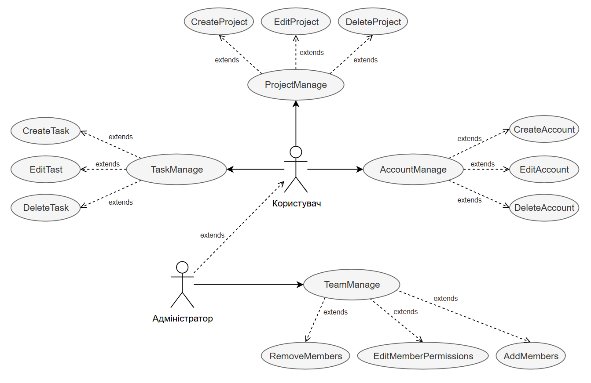

# Розроблення функціональних вимог до системи

## Модель прецедентів

### Загальна схема

### Користувач

### Адміністратор

## Сценарії використання

| ID:                | ` CreateAccount ` |
| :------------------| :--------------|     
| Назва:             | Створення акаунту |
| Учасники:          | Користувач, система |
| Передумови:        | Користувач не має акаунту в системі |
| Результат:         |  
Створено новий акаунт
 |
| Виключні ситуації: | - Обов’язкові поля не заповнені — ` NullReferenceException ` - Акаунт вже існує — ` UserAlreadyExistsException ` - Пароль не відповідає вимогам — ` NotStrongPasswordException ` |
| Основний сценарій: | 1. Користувач відкриває форму реєстрації 2. Вводить необхідні дані 3. Натискає "Зареєструватися" 4. Перевіряється коректність введених даних 5. Якщо всі перевірки пройдені, створюється акаунт |

 

| ID:                | ` EditAccount ` |
| :------------------| :--------------|      
| Назва:             | Редагування інформації акаунту |
| Учасники:          | Користувач, система |
| Передумови:        | Користувач авторизований |
| Результат:         | 
Оновлена інформація про акаунт
 |
| Виключні ситуації: | - Некоректний формат даних — ` InvalidDataException ` |
| Основний сценарій: | 1. Користувач переходить у налаштування акаунту 2. Вносить зміни 3. Натискає "Зберегти" 4. Перевіряється коректність введених даних 5. Якщо все коректно, оновлюється інформація про акаунт |

| ID:                | ` DeleteAccount ` |
| :------------------| :--------------|
| Назва:             | Видалення акаунту |
| Учасники:          | Користувач, система |
| Передумови:        | Користувач авторизований |
| Результат:         | Акаунт видалено |
| Виключні ситуації: | - Користувач не підтвердив видалення — ` CancelledOperationException ` |
| Основний сценарій: | 1. Користувач переходить у налаштування 2. Обирає "Видалити акаунт" 3. Підтверджує дію 4. Видаляється акаунт |

| ID:                |
` CreateProject `
   |
| :------------------| :--------------|      
| Назва:             | Створення проєкту |
| Учасники:          | Користувач, система |
| Передумови:        | Користувач авторизований |
| Результат:         | Створено новий проєкт |
| Виключні ситуації: | - Некоректно введені дані — ` InvalidDataException ` |
| Основний сценарій: | 1. Користувач натискає "Створити проєкт" 2. Заповнює необхідні поля 3. Підтверджує дію 4. Перевіряється коректність введених даних 5. Якщо все коректно, створюється проєкт |

| ID:                | 
` EditProject `
 |
| :------------------| :--------------|      
| Назва:             | Редагування проєкту |
| Учасники:          | Користувач, система |
| Передумови:        | Користувач має дозвіл на редагування |
| Результат:         | Оновлена інформація про проєкт |
| Виключні ситуації: | - Доступ заборонено — ` AccessDeniedException ` |
| Основний сценарій: | 1. Користувач відкриває проєкт 2. Вносить зміни 3. Натискає "Зберегти" 4. Перевіряється коректність введених даних 5. Якщо все коректно, зберігаються зміни |

| ID:                | 
` DeleteProject `
 |
| :------------------| :--------------|      
| Назва:             | Видалення проєкту |
| Учасники:          | Користувач, система |
| Передумови:        | Користувач має права на видалення |
| Результат:         | Проєкт видалено |
| Виключні ситуації: | - Доступ заборонено — ` AccessDeniedException ` |
| Основний сценарій: | 1. Користувач відкриває проєкт 2. Натискає "Видалити" 3. Підтверджує дію 4. Видаляється проєкт |

| ID:                | 
` AddMembers `
 |
| :------------------| :--------------|
| Назва:             | Додавання учасників у проєкт |
| Учасники:          | Адміністратор, система |
| Передумови:        | Користувач має права на додавання |
| Результат:         | Додані нові учасники |
| Виключні ситуації: | - Доступ заборонено — ` AccessDeniedException ` - Користувач уже в команді — ` UserAlreadyInTeamException ` |
| Основний сценарій: | 1. Адміністратор відкриває налаштування команди 2. Додає нових учасників, вводячи їхню пошту або ID 3. Перевіряється коректність введених даних 4. Якщо все коректно, додаються учасники |

