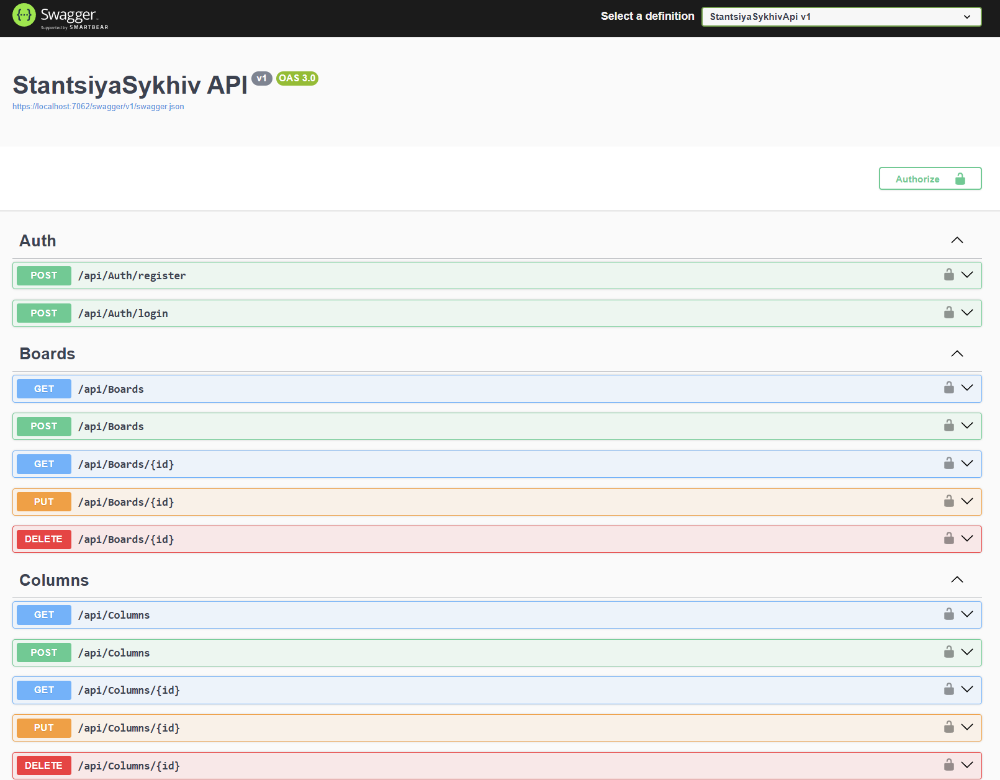
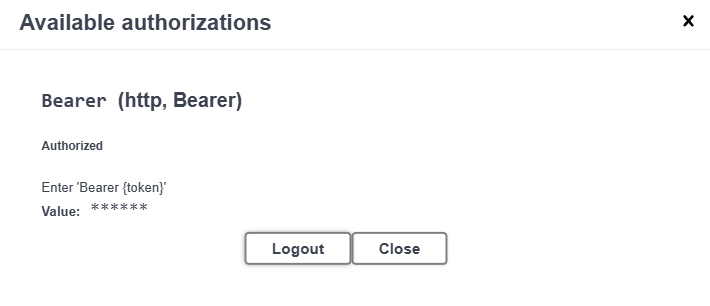
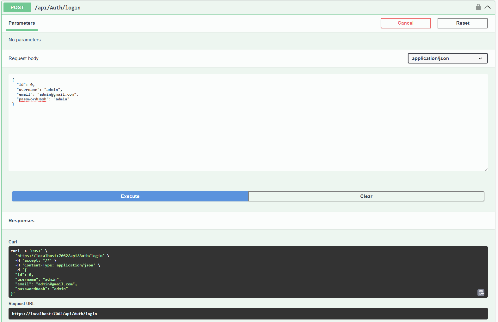
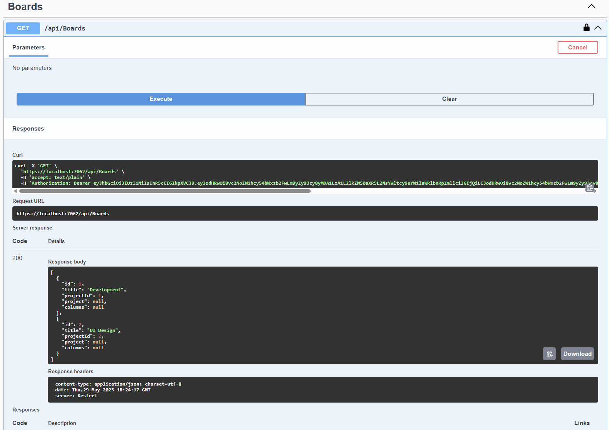
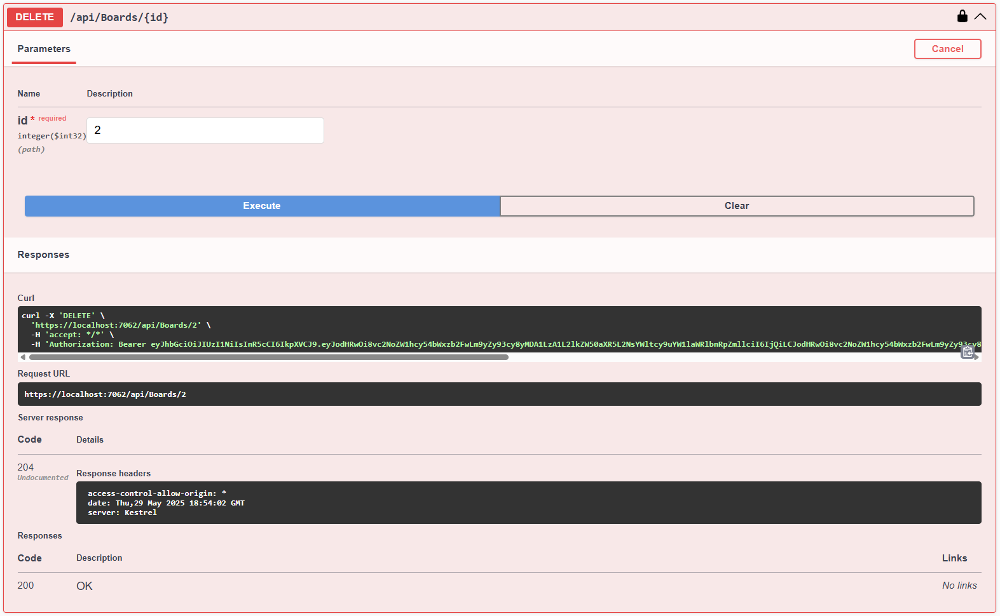

# Тестування працездатності системи

Тестування здійснюється через застосунок [StantsiyaSykhivApi](https://github.com/unxwn/stantsiya-sykhiv/blob/main/src/scripts/README.md) за допомогою документації OpenAPI.

## Головна сторінка

## Автентифікація

## Отримати всі дошки

## Отримати дошку пo id

## Створити нову дошку

## Змінити існуючу дошку

## Видалити дошку

