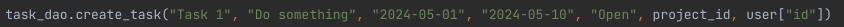

# Тестування працездатності системи

Цей проєкт показує базову реалізацію DAO (Data Access Object) для взаємодії з базою даних MySQL. Була використана мова Python.

1. Створення користувача

Результат:

---

2. Створення проекту\

Результат:\

---

3. Читання проекту\

Результат:\

---

4. Створення дошки\

Результат:\

---

5. Створення колонки\

Результат:\

---

6. Створення завдання\

Результат:\

---

7. З'єднання колонки і завдання\

Результат:\

---

8. Створення коментарю\

Результат:\

